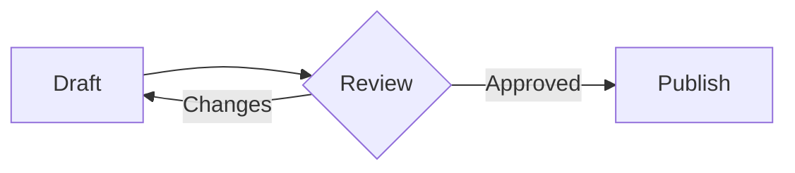

# Notion Flow — 5-minute tour

[中文版本](notion-flow-demo.zh.md)

> Copy this note into an Obsidian vault, make a working copy, and open it in **Live Preview** on desktop. Most features used below are enabled by default under **Settings → Notion Flow**.

## 1. Move and create blocks

Hover this paragraph. Drag `⋮⋮` to move the whole paragraph, click `⋮⋮` to open its block menu, or click `+` to create a block below and open the slash menu.

While dragging, move the pointer left or right to change the nesting level. Try moving the following parent item; all of its nested content travels with it.

- A project update
  - Draft is ready
  - Review is scheduled

  ```ts
  const project = { status: "ready" };
  project.status;
  ```

  > A nested quote stays aligned with its parent item.

  > [!tip] A nested Callout
  > Its title and body move as one block.

Click a handle without dragging and try **Turn into**, **Duplicate**, and **Copy text**. Use **Delete block** only on content you do not mind removing.

To work on several blocks at once, drag a selection frame from the empty space beside the lines above, or hold `Alt/Option` and drag from anywhere in the editor. The floating toolbar that appears converts every selected ordinary block in one step; tables, fenced code blocks, and multi-line quotes are skipped so their structure stays intact. Press `Esc` or click × to clear the selection.

## 2. Insert with slash commands

Replace the practice text below with `/`, then keep typing to filter the menu. English and Chinese search terms both work.

Practice line — type `/` here.

Useful searches include `/h1`, `/h2`, `/h3`, `/bullet`, `/number`, `/todo`, `/quote`, `/callout`, `/toggle`, `/code`, `/table`, `/divider`, `/image`, and `/link`.

For a table of a custom size, select **Table** with the pointer. In the size picker, drag across the grid or use arrow keys and press `Enter`. Pressing `Enter` directly on the slash result inserts a 3 × 3 table.

## 3. Edit a table

Click a cell in this rendered table to open the table toolbar.

| Task | Owner | Status |
| :--- | :--- | :---: |
| Outline the note | Alex | Ready |
| Review examples | Mei | In progress |
| Publish the guide | Sam | Not started |

Try these actions:

- Add a row or column, then remove it.
- Align the active column.
- Apply a cell background and a table background, then remove either color.
- Choose **Format table**.
- Press `Alt+F10`, then move between toolbar buttons with left and right arrows.
- Click the table's `⋮⋮` handle to open whole-table actions or move the complete table.

### Raw Markdown table exercise

The navigation below applies only in **Source mode** or while a raw `|` table has not rendered yet.

1. On a blank line, type `| Name | Quantity` and press `Tab` to complete the table structure.
2. Use `Tab` and `Shift+Tab` to move between cells.
3. Use `Enter` to move down the current column.
4. Continue from the final cell to append a row.
5. Press `Enter` on an empty final row to remove it and leave the table.

## 4. Format text

Select part of the next sentence. Use the floating toolbar to apply bold, italic, underline, strikethrough, text color, highlight, inline code, or a link. Finish by trying **Clear formatting**.

Select and format this sentence without leaving Live Preview.

Standard Markdown examples: **bold**, *italic*, ~~strikethrough~~, `inline code`, ==highlight==, and an [external link](https://obsidian.md/).

To try URL pasting, select the words Obsidian Help and paste `https://help.obsidian.md/`. The selected text becomes a Markdown link when **Paste URLs as links** is enabled.

If **Conceal HTML formatting tags** is enabled, underline and color tags stay out of the way in Live Preview. **Conceal inline Markdown syntax** is off by default; turn it on to compare both editing styles.

## 5. Compare appearance

Switch between Live Preview and Reading view after trying these blocks.

- First level
  - Second level
    - Third level
      - Fourth level

1. First step
   1. Nested step
      1. Deeper step

- [ ] Try a slash command
- [ ] Move a block
- [x] Open the formatting toolbar

> Quote markers are softened while the line is inactive and return when you edit it.

---

Cleaner rendering also affects the divider above, tasks, and `inline code`. Table styling, header tint, striped rows, and list marker colors have separate settings.

### Mermaid diagrams and code themes



With **Cleaner WYSIWYG rendering** on, the diagram above renders on a bordered, theme-aware canvas. Wide diagrams keep readable labels and scroll horizontally instead of shrinking; focus the diagram to scroll it with a keyboard or trackpad.

Fenced code blocks — like the `ts` block in section 1 — follow the **Code block theme** setting. Try switching from **Theme default** to **Obsidian adaptive** or one of the other nine palettes; supported palettes swap their light and dark variants automatically.

## 6. Try shortcuts

Place the caret in the sandbox paragraph below.

- `Alt/Option+↑` or `Alt/Option+↓` moves its block.
- `Alt/Option+Shift+D` duplicates its block.
- These block shortcuts can be rebound in Obsidian's **Hotkeys** settings.

Sandbox paragraph — move or duplicate me.

## 7. If something does not appear

- Block handles require desktop Live Preview and **Drag-and-drop blocks**.
- The text and in-place table toolbars require **Floating format toolbar**.
- Raw-table `Tab` and `Enter` behavior requires **Table editing enhancements**.
- A selection entirely inside a rendered Callout or colored word may not map back to the editor. Open its source or extend the selection into normal editor text.
- To start over, use **Settings → Notion Flow → Restore defaults**, then replace this working copy with the original example note.
