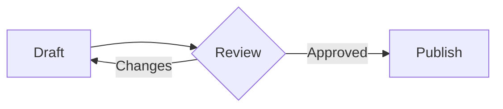

# Notion Flow — 10-minute tour

[中文版本](notion-flow-demo.zh.md) · [Style sampler](notion-flow-style-demo.md)

> Copy this note into an Obsidian vault, make a working copy, and open it in **Live Preview** on desktop. Most features used below are enabled by default under **Settings → Notion Flow**.

## 1. Move and create blocks

Hover this paragraph. Drag `⋮⋮` to move the whole paragraph, click `⋮⋮` to open its block menu, or click `+` to create a block below and open the slash menu.

While dragging, move the pointer left or right to change the nesting level. Try moving the following parent item; all of its nested content travels with it.

- A project update
	- Draft is ready
	- Review is scheduled

  ```ts
  const project = { status: "ready" };
  project.status;
  ```

  > A nested quote stays aligned with its parent item.

  > [!tip] A nested Callout
  > Its title and body move as one block.

Click a handle without dragging and try **Turn into**, **Duplicate**, and **Copy text**. Use **Delete block** only on content you do not mind removing.

The block menu also has **Block color** (text or background), **Move to…** and **Turn into page**. On a list item, `+` adds the next item.

To work on several blocks at once, drag a selection frame from the empty space beside the lines above, or hold `Alt/Option` and drag from anywhere in the editor. The floating toolbar that appears converts every selected ordinary block in one step; tables, fenced code blocks, and multi-line quotes are skipped so their structure stays intact. Press `Esc` or click × to clear the selection.

## 2. Select blocks with the keyboard

Click into the first practice paragraph below and press `Esc`: the whole block is selected. Then:

- `↑` / `↓` walk to the block above or below, `Shift+↑` / `Shift+↓` extend the selection.
- `Alt/Option+↑` / `↓` move the selected blocks, `Cmd/Ctrl+D` duplicates them, `Backspace` deletes them.
- `Cmd/Ctrl+Alt/Option+=` inserts a block below the selection (`+Shift` above) and opens the slash menu.
- `Enter` returns to writing at the end of the selection; a second `Esc` clears it.

First practice paragraph.

Second practice paragraph.

Third practice paragraph.

## 3. Insert with slash commands

Replace the practice text below with `/`, then keep typing to filter the menu. English and Chinese search terms both work.

Practice line — type `/` here.

Useful searches include `/h1`, `/h2`, `/h3`, `/bullet`, `/number`, `/todo`, `/quote`, `/callout`, `/toggle`, `/code`, `/table`, `/divider`, `/image`, and `/link`. A Callout type or a color can be searched by name: `/tip` inserts a tip Callout, `/red background` gives the block a red background. `/toc` writes a table of contents of this note's headings, and `/template` lists the notes in your templates folder when the core **Templates** plugin is on.

Selecting **Table** — with the pointer or `Enter` — opens a size grid: drag across it or use the arrow keys, then press `Enter`. Type the size into the command (`/table4x6`) to skip the grid.

## 4. Edit a table

Click a cell in this rendered table to open the table toolbar.

| Task | Owner | Status |
| :--- | :--- | :---: |
| Outline the note | Alex | Ready |
| Review examples | Mei | In progress |
| Publish the guide | Sam | Not started |

Try these actions:

- Add a row or column, then remove it.
- Align the active column.
- Apply a cell background and a table background, then remove either color.
- Choose **Format table**.
- Press `Alt+F10`, then move between toolbar buttons with left and right arrows.
- Click the table's `⋮⋮` handle to open whole-table actions or move the complete table.
- Right-click inside the table: every table action is under **Table**.

### Raw Markdown table exercise

The navigation below applies only in **Source mode** or while a raw `|` table has not rendered yet.

1. On a blank line, type `| Name | Quantity` and press `Tab` to complete the table structure.
2. Use `Tab` and `Shift+Tab` to move between cells.
3. Use `Enter` to move down the current column.
4. Continue from the final cell to append a row.
5. Press `Enter` on an empty final row to remove it and leave the table.

## 5. Format text

Select part of the next sentence. Use the floating toolbar to apply bold, italic, underline, strikethrough, text color, highlight, inline code, or a link. Finish by trying **Clear formatting**.

Select and format this sentence without leaving Live Preview.

Standard Markdown examples: **bold**, *italic*, ~~strikethrough~~, `inline code`, ==highlight==, and an [external link](https://obsidian.md/).

`Cmd/Ctrl+K` opens the link card, where you edit the text and the destination (with note suggestions); `Cmd/Ctrl+U` underlines.

To try URL pasting, select the words Obsidian Help and paste `https://help.obsidian.md/`. The selected text becomes a Markdown link when **Paste URLs as links** is enabled.

If **Conceal HTML formatting tags** is enabled, underline and color tags stay out of the way in Live Preview. **Conceal inline Markdown syntax** is on by default: markers such as `**` appear only while the caret is inside them. Turn it off to compare both editing styles.

## 6. Comments

This sentence has a <span class="nf-cmt" data-nf-cmt="Comments are stored inside the note and stay invisible in other Markdown apps.">comment on it</span> — hover the words or the 💬 after them to read it, then try **Edit** and **Resolve**.

Select a few words in this line and press `Cmd/Ctrl+Shift+M` (or the toolbar's 💬 button) to add your own.

Run **Show comments in this note** from the command palette to list every comment: `Enter` jumps to one, `Cmd/Ctrl+Enter` resolves it.

## 7. Columns and toggles

Click either column to edit it in place; drag the gap between them to resize.

> [!nf-cols]
> > [!nf-col]
> > **Left column.** Drag any block by its handle onto the right edge of another block to put them side by side.
>
> > [!nf-col]
> > **Right column.** Use the small column button at the top right for widths or to unwrap the row.

> [!nf-toggle]+ Click the triangle to fold this toggle
> Its open state is saved in the note (`+` open, `-` closed), so it survives reloads and sync.

> [!nf-toggle]- A closed toggle
> Hidden content.

On macOS, `Cmd+Option+T` collapses or expands every toggle in the note at once; the commands **Collapse all toggles** and **Expand all toggles** work everywhere.

## 8. Compare appearance and try a note style

Switch between Live Preview and Reading view after trying these blocks.

- First level
	- Second level
		- Third level
			- Fourth level

1. First step
	1. Nested step
		1. Deeper step

- [ ] Try a slash command
- [ ] Move a block
- [x] Open the formatting toolbar

> Quote markers are softened while the line is inactive and return when you edit it.

---

Cleaner rendering also affects the divider above, tasks, and `inline code`. Table styling, header tint, striped rows, and list marker colors have separate settings.

### Mermaid diagrams and code themes


```mermaid
flowchart LR
  A[Draft] --> B{Review}
  B -->|Approved| C[Publish]
  B -->|Changes| A
```

With **Cleaner WYSIWYG rendering** on, the diagram above renders on a bordered, theme-aware canvas. Wide diagrams keep readable labels and scroll horizontally instead of shrinking; focus the diagram to scroll it with a keyboard or trackpad.

Fenced code blocks — like the `ts` block in section 1 — follow **Code block theme**, which by default follows the note palette (with the Classic palette, your theme's colors). Pick a theme in the settings gallery to override it.

### Try a note style

Run **Change note style…** from the command palette. `↑` / `↓` preview each palette and look on this note live, `Tab` switches between palettes and looks, `Enter` keeps the one you like, `Esc` puts everything back. The [style sampler](notion-flow-style-demo.md) shows every component a look restyles on one page. The same choices live under **Settings → Notion Flow → Note style**.

## 9. Shortcuts and the shortcut guide

Place the caret in the sandbox paragraph below.

- `Alt/Option+↑` or `Alt/Option+↓` moves its block.
- `Alt/Option+Shift+D` duplicates its block.
- `Cmd+Option+1` (`Ctrl+Shift+1` on Windows and Linux) turns it into Heading 1; `…+0` turns it back into text.
- On macOS, `Cmd+Option+=` inserts a block below it and opens the slash menu, and `Cmd+Option+Shift+=` inserts one above. On Windows and Linux these two have no default chord.
- These block shortcuts can be rebound in Obsidian's **Hotkeys** settings.

Sandbox paragraph — move or duplicate me.

**Open shortcut guide** (command palette, or **Settings → Notion Flow → Keyboard shortcuts**) lists every chord, block-selection key and shorthand.

## 10. Canvas mind maps

Copy [the Canvas example](canvas-flow-demo.canvas) into your vault next to this note and open it (**Canvas enhancements** must be on).

- Select a card: `Tab` adds a child, `Enter` the next card, `Shift+Enter` a sibling above.
- While typing in a card, `Enter` finishes it and keeps it selected — press `Enter` again for the next card or `Tab` for a child. `Shift+Enter` breaks the line.
- The toolbar's **Style** panel offers color schemes; a map without one follows your note palette (**Maps follow the note palette**).
- The **?** at the end of the toolbar opens the **Canvas guide**.

## 11. If something does not appear

- Block handles require desktop Live Preview and **Drag-and-drop blocks**.
- The text and in-place table toolbars require **Floating format toolbar**.
- Raw-table `Tab` and `Enter` behavior requires **Table editing enhancements**.
- Comments, columns, and toggles each have their own setting: **Comments**, **Columns**, and **Toggles**.
- The page icon and cover need **Page icon and cover** to be on.
- Palettes and looks restyle only what the plugin draws — Obsidian's own theme still owns the rest of the window.
- A selection entirely inside a rendered Callout or colored word may not map back to the editor. Open its source or extend the selection into normal editor text.
- To start over, use **Settings → Notion Flow → Restore defaults**, then replace this working copy with the original example note.
